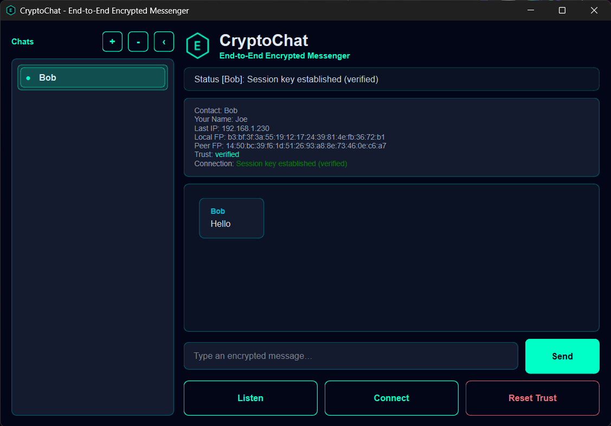
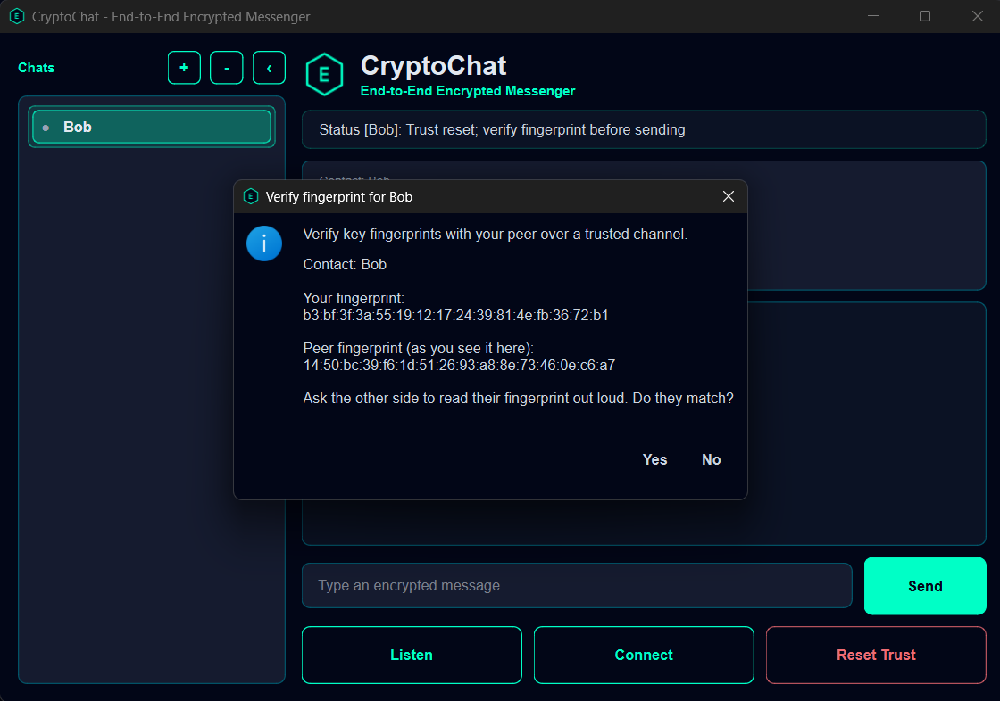
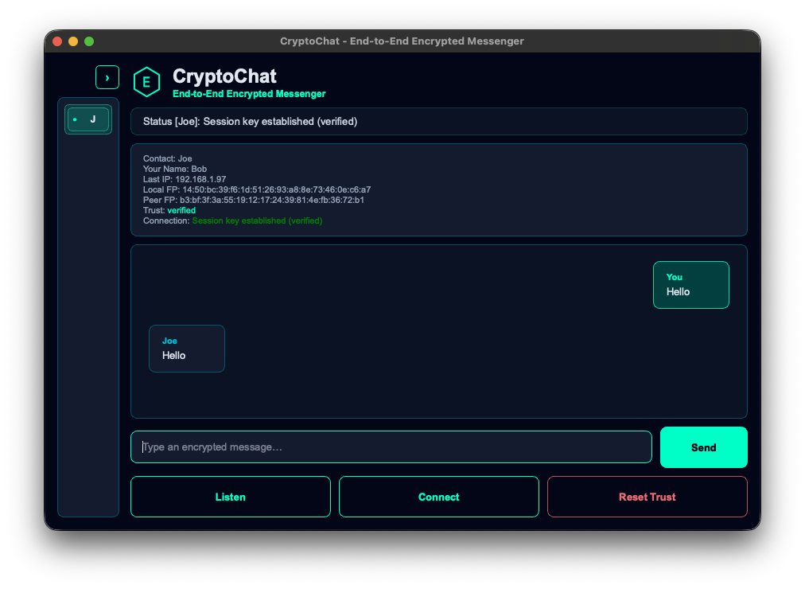
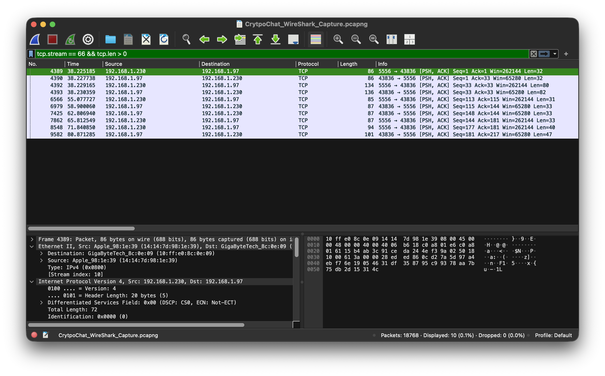

# CryptoChat - End-to-End Encrypted Messenger

CryptoChat is an educational secure messaging application built with Python, PyQt6, X25519, HKDF-SHA256, and AES-256-GCM. It demonstrates the core building blocks behind end-to-end encrypted messaging while staying small enough to read, run, test, and explain as a cybersecurity portfolio project.

This is not a production Signal replacement. It is a focused applied-cryptography project that shows correct use of key exchange, AEAD encryption, directional keys, replay protection, and TOFU fingerprint verification.

## Highlights

- PyQt6 desktop chat interface with a dark cybersecurity-themed UI
- Ephemeral X25519 Diffie-Hellman key exchange per connection
- HKDF-SHA256 key derivation with `CryptoChat-v1` protocol context
- Separate AES-256-GCM keys for client-to-server and server-to-client traffic
- Authenticated packet counters for replay protection
- Persistent TOFU fingerprint verification
- Send blocking until the peer fingerprint is trusted
- Encrypted display-name exchange after session setup
- Safer length-prefixed TCP framing with message-size limits
- Unit tests for crypto/session behavior

## Screenshots

### Verified Encrypted Chat



### Fingerprint Verification



### Collapsed Chat Sidebar



### Encrypted Traffic Capture



Additional demo screenshots are included in `cryptochat-project/Assets/` for portfolio writeups and project documentation.

## Project Structure

```text
cryptochat-project/
  app.py                  # PyQt6 GUI, chats, trust prompts, send gating
  peer.py                 # TCP framing, role-aware handshake, identity exchange
  crypto_utils.py         # X25519, HKDF, AES-GCM packets, fingerprints
  Assets/                 # App logo/favicon and README screenshot assets
  tests/
    test_crypto_utils.py  # Session/key/replay/fingerprint tests
README.md
THREAT_MODEL.md
requirements.txt
```

## Requirements

- Python 3.10+
- PyQt6
- cryptography
- pytest, for tests

Install dependencies:

```bash
python3 -m venv .venv
source .venv/bin/activate
pip install -r requirements.txt
```

On Windows PowerShell:

```powershell
python -m venv .venv
.\.venv\Scripts\Activate.ps1
pip install -r requirements.txt
```

## Run The App

Open two terminal windows.

Terminal A:

```bash
cd cryptochat-project
python3 app.py
```

Enter a display name, select the default chat, then click `Listen`.

Terminal B:

```bash
cd cryptochat-project
python3 app.py
```

Enter a different display name, select the default chat, click `Connect`, then enter the server IP address. Use `127.0.0.1` for a local demo on the same machine.

## Demo Flow

1. Start one app instance and click `Listen`.
2. Start a second app instance and click `Connect`.
3. Enter `127.0.0.1` for a local demo, or the server machine's LAN IP for two devices.
4. Watch the `Unknown` chat rename to the peer's encrypted display name.
5. Compare the peer fingerprint over a trusted channel.
6. Accept the TOFU verification prompt only if the fingerprint matches.
7. Send messages after the contact is marked verified.
8. Optionally capture traffic with Wireshark to show ciphertext on the wire.

## Run Tests

```bash
cd cryptochat-project
pytest
```

The tests cover:

- client/server directional key pairing
- encryption and decryption in both directions
- ciphertext tampering failure
- replay rejection
- receive-counter behavior after failed decrypt
- role-specific send/receive key assignment
- fingerprint stability for the same public key

## Security Design

### Directional Keys

After X25519, CryptoChat derives 64 bytes of key material with HKDF-SHA256 using the protocol context `CryptoChat-v1`.

- First 32 bytes: client-to-server AES-GCM key
- Second 32 bytes: server-to-client AES-GCM key

This prevents AES-GCM key/nonce reuse across traffic directions.

### Replay Protection

Each encrypted packet contains an 8-byte counter followed by AES-GCM ciphertext and tag. The counter is authenticated as associated data along with the protocol name and traffic direction. The receiver accepts only the next expected counter, and the receive counter advances only after authentication succeeds.

### TOFU Fingerprint Verification

CryptoChat uses Trust On First Use fingerprint verification. Accepted peer fingerprints are saved in a user-local trust file:

- macOS: `~/Library/Application Support/CryptoChat/trusted_contacts.json`
- Linux/other: `~/.cryptochat/trusted_contacts.json`

If a saved fingerprint does not match on a future connection, the UI warns the user and blocks sending until trust is reset and re-verified.

### Display Names

Display names are encrypted after the session key is established, but they are convenience labels only. They are not cryptographic identity. Fingerprints are still the security identity users must verify.

## Threat Model

See [THREAT_MODEL.md](THREAT_MODEL.md) for the full security analysis, assumptions, adversary model, mitigations, and limitations.

In short, CryptoChat protects against passive network eavesdropping, ciphertext tampering, simple replay attacks, and fingerprint changes after trust has been established. It does not protect against compromised devices, malware, keyloggers, malicious local users, or users accepting the wrong fingerprint.

## Known Limitations

- No long-term identity key architecture
- No group messaging
- No offline message queue
- No message database
- No file transfer
- No padding, so approximate message sizes are visible
- No local device hardening
- No formal security audit
- No double-ratchet message-key rotation

These limits are intentional. The project is meant to demonstrate secure messaging fundamentals in a compact, understandable codebase.

## GitHub Setup Notes

When creating the GitHub repository, do not initialize it with a README, `.gitignore`, or license from the GitHub web form. This project already includes the README and `.gitignore`.

After creating the empty GitHub repository:

```bash
cd /Users/flaco/Documents/Projects/CryptoChat
git init
git add .
git commit -m "Initial CryptoChat portfolio project"
git branch -M main
git remote add origin https://github.com/esixtosr/REPOSITORY-NAME.git
git push -u origin main
```

Replace `REPOSITORY-NAME` with the repository name you choose.

## Portfolio Summary

CryptoChat demonstrates applied cryptography and secure messaging fundamentals through a polished PyQt6 desktop app: X25519 key exchange, HKDF key derivation, AES-GCM authenticated encryption, directional key separation, replay protection, persistent TOFU fingerprint verification, clear trust-state UI, and an honest threat model.
